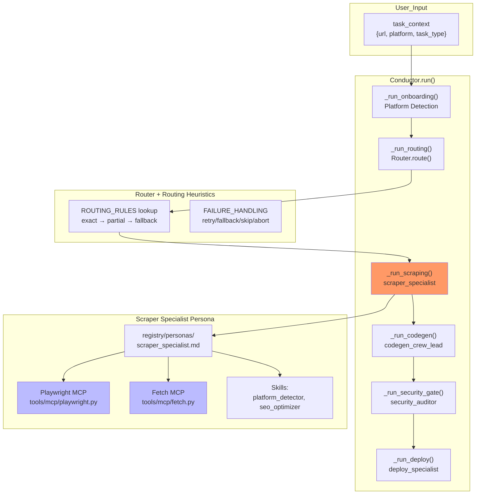
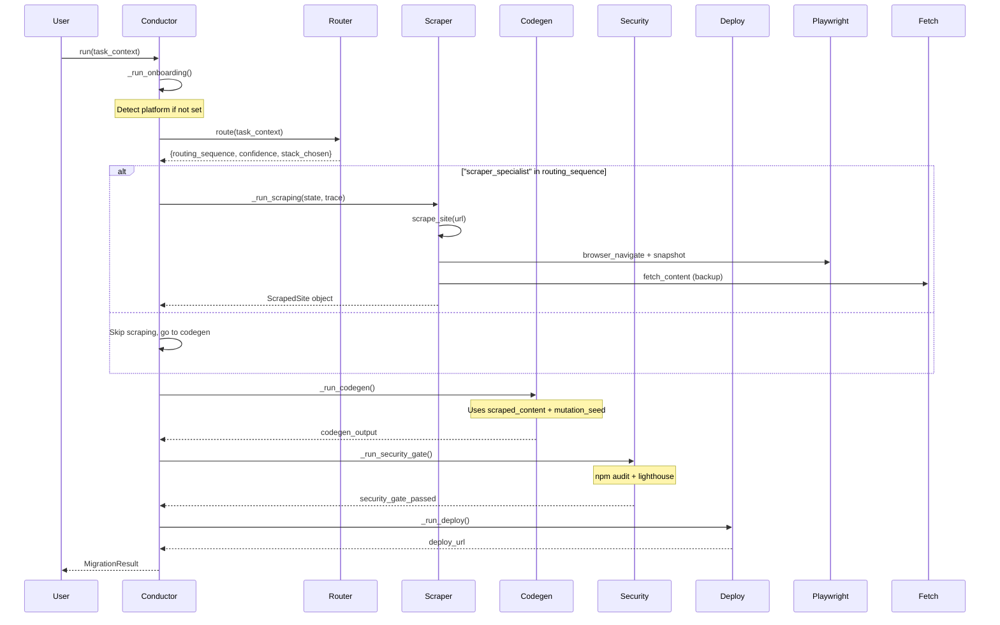
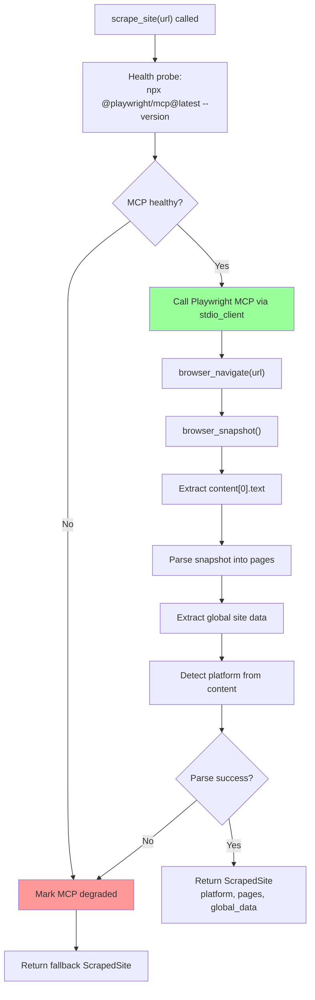
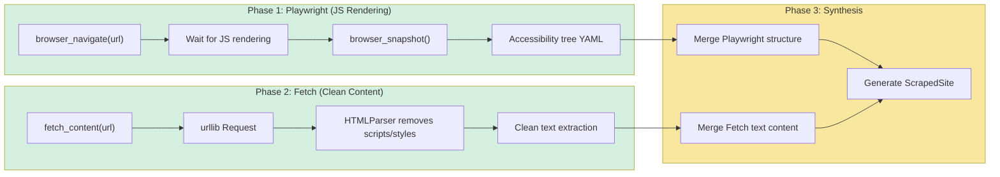
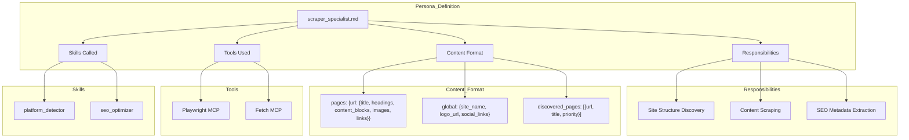
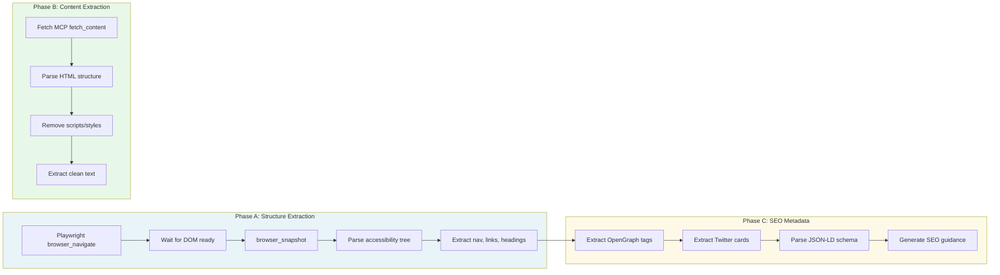
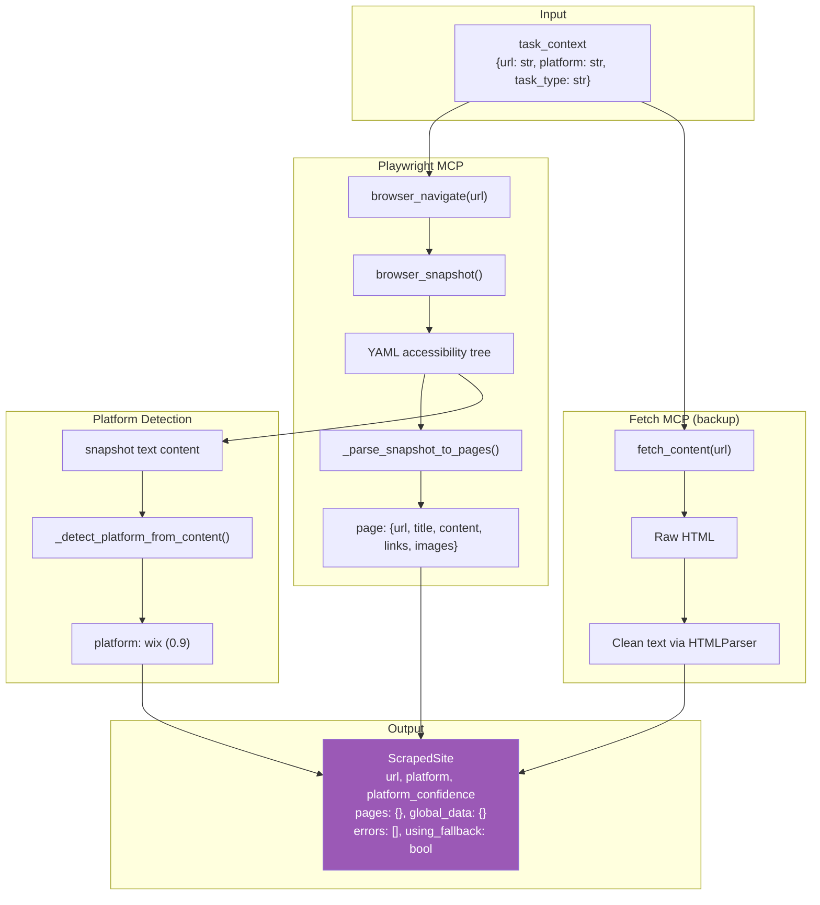
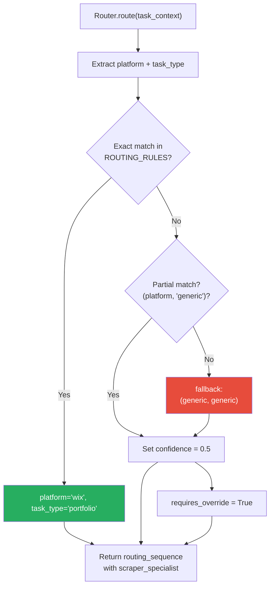
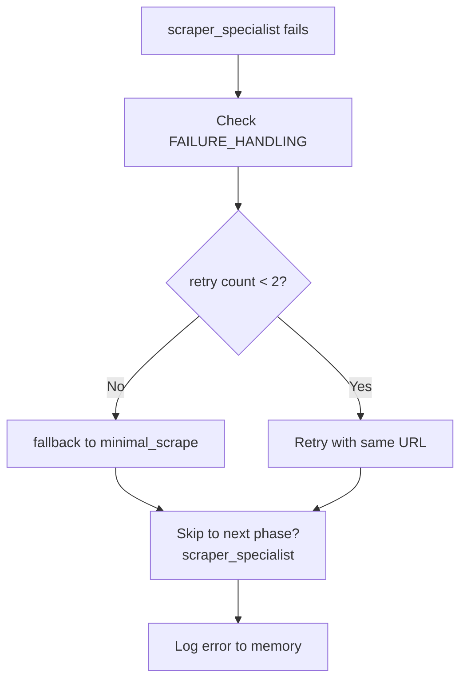

# Scraping Architecture - Detailed Process Graph

**Date:** 2026-05-05
**Purpose:** Document how scraping works end-to-end, from Conductor orchestration through the scraper_specialist persona to MCP tools

---

## High-Level Process Flow



---

## Conductor Orchestration Detail

### Phase Execution Order



---

## Scraping Process Detail

### How `scrape_site()` Works



### Two-Phase Scraping: Playwright + Fetch



---

## Scraper Specialist Persona

### Persona Definition (`registry/personas/scraper_specialist.md`)



### Scraping Phases (A, B, C)



---

## Data Flow: task_context → ScrapedSite



---

## Routing Integration

### How Router Decides to Invoke Scraper



### Routing Rules Table

| Platform | Task Type | Routing Sequence | Confidence |
|----------|-----------|------------------|-------------|
| wix | portfolio | onboarding → scraper → stack_intel → codegen → ui_polish → security → deploy | 1.0 |
| wix | blog | onboarding → scraper → stack_intel → codegen → seo → deploy | 0.95 |
| squarespace | portfolio | onboarding → scraper → stack_intel → codegen → ui_polish → security → deploy | 1.0 |
| wordpress | business | onboarding → scraper → stack_intel → codegen → security → deploy | 0.9 |
| generic | generic | LLM override required | 0.5 |

---

## Failure Handling

### FAILURE_HANDLING Configuration



### Failure Actions

| Persona | Retry | Fallback | Action on Abort |
|---------|-------|----------|-----------------|
| scraper_specialist | 2 | minimal_scrape | Skip to codegen with empty pages |
| codegen_crew_lead | 1 | simplified_codegen | Abort migration |
| security_auditor | 0 | - | Always abort |
| deploy_specialist | 2 | staging_only | Deploy with warning |

---

## Current Implementation Status

### What Works (Phase 1)

| Component | Status | Notes |
|-----------|--------|-------|
| Conductor orchestration | ✅ | Linear phase execution |
| Router + routing rules | ✅ | Table-based lookup |
| Playwright MCP scraping | ✅ | browser_navigate + snapshot |
| Self-healing fallback | ✅ | Health probe + stub return |
| Platform detection from content | ✅ | wix (0.9) for wixstudio.com |

### What Needs Wiring (Current Session)

| Component | Status | Notes |
|-----------|--------|-------|
| `_run_scraping` calls Playwright | ✅ | Now uses real scrape_site() |
| Fetch MCP integrated | ❌ | Not used in scrape_site yet |
| Conductor wired to Playwright | ❌ | Orchestrator still uses stub |
| Conductor wired to Fetch | ❌ | Not connected |

### Missing Wiring

```
conductor/orchestrator.py _run_scraping():
    CURRENT: state["scraped_content"] = {pages: {}, errors: ["stub"]}
    NEEDED:  state["scraped_content"] = await scrape_site(url)
```

---

## Tools Available to Scraper Specialist

### Playwright MCP (`tools/mcp/playwright.py`)

```python
async def scrape_site(url: str, use_mcp: bool = True) -> ScrapedSite:
    """Main scraping function"""

async def get_page_content(url: str) -> PageContent:
    """Get content from single page"""

async def render_js(url: str) -> str:
    """Render JS-heavy page, fallback to Fetch"""
```

### Fetch MCP (`tools/mcp/fetch.py`)

```python
def fetch_content(url: str, timeout: int = 30) -> FetchResult:
    """HTTP fetch with HTML parsing"""

@dataclass
class FetchResult:
    url: str
    status_code: int
    html: str
    text: str
    metadata: dict
    error: Optional[str]
```

---

## Skills Available to Scraper Specialist

### platform_detector (`skills/executable/platform_detector.py`)

```python
def detect_platform(url: str, html=None, fetch_on_low_confidence=True) -> dict:
    """Multi-stage: URL pattern → HTML markers → LLM fallback"""
    # Returns: {platform, confidence, indicators, error}
```

### seo_optimizer (`skills/executable/seo_optimizer.py`)

```python
def get_seo_guidance(scraped_site: ScrapedSite) -> dict:
    """Generate SEO recommendations from scraped content"""
    # Returns: {title_template, meta_description_template, recommendations, ...}
```

---

## Next Steps: Wire Fetch MCP into Scraping

### Current Flow (One-Phase)

```
scrape_site(url)
    → Playwright MCP only
    → _parse_snapshot_to_pages() extracts structure
    → Returns ScrapedSite
```

### Target Flow (Two-Phase)

```
scrape_site(url)
    → Playwright MCP (structure + JS content)
    → Fetch MCP (clean text backup)
    → Combine results
    → Returns richer ScrapedSite
```

### Implementation Changes

1. **In `scrape_site()`**: After Playwright snapshot, call `fetch_content(url)` as backup
2. **In `_run_scraping()`**: Call both Playwright + Fetch, merge results
3. **Add `_merge_scraping_results()`**: Combine Playwright structure with Fetch text

---

## Questions/Open Items

1. **Scraping depth**: How many pages should we follow? Home/About/Portfolio only or all discovered pages?
2. **Fetch fallback timing**: Should we try Fetch first if Playwright is degraded, or always try Playwright first?
3. **Conductor integration**: Should `_run_scraping` directly call `scrape_site()` or go through the persona system?
4. **Persona vs direct MCP**: The scraper_specialist persona definition says it uses Playwright + Fetch tools, but the orchestrator doesn't invoke personas - it directly calls methods. How should this work?